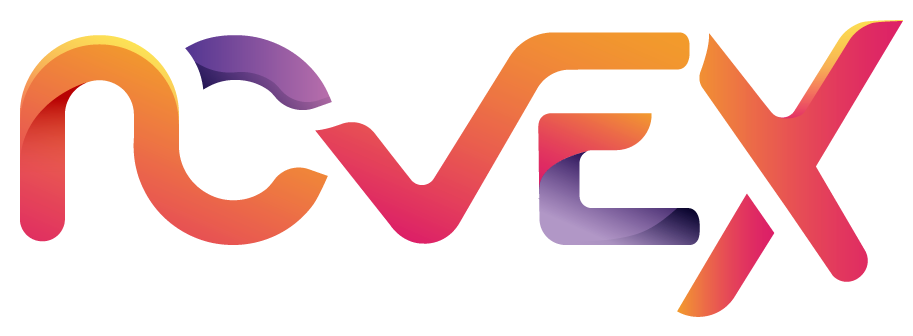

<p align="center">
  
</p>

git # Novex v2

ERP multi-tenant desarrollado con Laravel 12 para la gestión operativa de múltiples empresas en una única plataforma, con aislamiento por tenant a nivel de base de datos.

## Tabla de contenidos

- [Descripción general](#descripción-general)
- [Stack tecnológico](#stack-tecnológico)
- [Arquitectura y multi-tenancy](#arquitectura-y-multi-tenancy)
- [Requisitos previos](#requisitos-previos)
- [Instalación completa con Laravel Sail](#instalación-completa-con-laravel-sail)
- [Configuración del entorno](#configuración-del-entorno)
- [Puesta en marcha](#puesta-en-marcha)
- [Base de datos y tenants](#base-de-datos-y-tenants)
- [Comandos útiles](#comandos-útiles)
- [Testing y calidad de código](#testing-y-calidad-de-código)
- [Estructura relevante del proyecto](#estructura-relevante-del-proyecto)
- [Documentación adicional](#documentación-adicional)

## Descripción general

Novex v2 es una aplicación ERP orientada a entornos multiempresa. La aplicación central gestiona autenticación, registro y aprovisionamiento de empresas, mientras que cada tenant opera sobre su propia base de datos.

Actualmente el proyecto incluye, entre otros, estos bloques funcionales:

- Autenticación web con Laravel Fortify.
- Login social con Google mediante Socialite.
- Dashboard interno para usuarios autenticados.
- Módulo de inventario.
- Módulo de recordatorios.
- Gestión de usuarios y panel de control.
- Aprovisionamiento automático de tenants.

## Stack tecnológico

- PHP 8.2+
- Laravel 12
- Laravel Sail
- MySQL 8.4
- Vite
- Alpine.js
- Tailwind CSS
- Stancl Tenancy
- PHPUnit
- Laravel Pint
- PHPStan
- ESLint
- Prettier

## Arquitectura y multi-tenancy

La aplicación utiliza `stancl/tenancy` con estrategia `database-per-tenant`.

Esto implica:

- La aplicación central usa una base de datos principal para usuarios, tenants, dominios y estado del aprovisionamiento.
- Cada tenant dispone de su propia base de datos para sus datos operativos.
- Las migraciones de tenant viven en `database/migrations/tenant`.
- El enrutado principal carga `routes/central.php` desde [bootstrap/app.php](/Users/davidjacobocastillo/Documents/TFG/novex-v2/bootstrap/app.php:13).

Archivos clave:

- [config/tenancy.php](/Users/davidjacobocastillo/Documents/TFG/novex-v2/config/tenancy.php:1)
- [routes/central.php](/Users/davidjacobocastillo/Documents/TFG/novex-v2/routes/central.php:1)
- [routes/tenant.php](/Users/davidjacobocastillo/Documents/TFG/novex-v2/routes/tenant.php:1)
- [app/Console/Commands/ProvisionTenant.php](/Users/davidjacobocastillo/Documents/TFG/novex-v2/app/Console/Commands/ProvisionTenant.php:1)

## Requisitos previos

Antes de empezar, asegúrate de tener instalado:

- Git
- Docker Desktop o Docker Engine + Docker Compose
- Composer
- Node.js 18 o superior
- npm

Versiones del proyecto:

- PHP requerido por Composer: `^8.2`
- Runtime de Sail definido en `compose.yaml`: `8.5`

Nota: si vas a trabajar exclusivamente con Sail, PHP local no es imprescindible para ejecutar la app, pero sí suele ser útil para algunos comandos fuera de contenedor.

## Instalación completa con Laravel Sail

### 1. Clonar el repositorio

```bash
git clone https://github.com/HerryMorgan11/Novex-v2.git
cd Novex-v2
```

### 2. Instalar dependencias PHP con Composer

```bash
composer install
```

### 3. Crear el archivo de entorno

```bash
cp .env.example .env
```

### 4. Revisar y ajustar variables de entorno

Edita `.env` antes de levantar el entorno. Como mínimo revisa:

```dotenv
APP_NAME=Novex
APP_ENV=local
APP_URL=http://localhost

DB_CONNECTION=mysql
DB_HOST=mysql
DB_PORT=3306
DB_DATABASE=laravel
DB_USERNAME=root
DB_PASSWORD=password

TENANT_DB_HOST=mysql
TENANT_DB_PORT=3306
TENANT_DB_USERNAME=root
TENANT_DB_PASSWORD=password

APP_DOMAIN=localhost
TENANT_DB_PREFIX=tenant_
```

También debes sustituir cualquier credencial externa por tus propios valores:

- `MAILERSEND_API_KEY`
- `GOOGLE_CLIENT_ID`
- `GOOGLE_CLIENT_SECRET`
- `GOOGLE_REDIRECT_URI`

### 5. Generar una nueva clave de aplicación

Hazlo después de crear `.env` y antes de usar la app:

```bash
php artisan key:generate
```

### 6. Instalar dependencias frontend

```bash
npm install
```

### 7. Levantar los contenedores con Sail

El repositorio ya incluye [compose.yaml](/Users/davidjacobocastillo/Documents/TFG/novex-v2/compose.yaml:1), por lo que no necesitas ejecutar `sail:install`.

```bash
./vendor/bin/sail up -d
```

### 8. Ejecutar las migraciones de la base de datos central

```bash
./vendor/bin/sail artisan migrate
```

### 9. Compilar o servir los assets frontend

Para desarrollo:

```bash
npm run dev
```

Para una build de producción:

```bash
npm run build
```

### 10. Acceder a la aplicación

Con la configuración por defecto:

- App web: `http://localhost`
- Vite dev server: `http://localhost:5173`

## Configuración del entorno

### Variables importantes

- `APP_URL`: URL base de la aplicación central.
- `APP_DOMAIN`: dominio central que no inicializa tenancy.
- `DB_*`: conexión de la base de datos central.
- `TENANT_DB_*`: credenciales usadas para crear y operar bases de datos de tenants.
- `QUEUE_CONNECTION`: por defecto está en `sync`.
- `CACHE_STORE`: está configurado como `database`.

### Sobre MySQL y credenciales de tenant

El aprovisionamiento de tenants crea bases de datos por empresa. Para que eso funcione correctamente, el usuario configurado en `TENANT_DB_USERNAME` debe tener permisos suficientes para crear bases de datos en MySQL.

En un entorno local con Sail, usar `root` para `DB_USERNAME` y `TENANT_DB_USERNAME` simplifica el aprovisionamiento. Si decides usar otro usuario, tendrás que conceder permisos adecuados de creación y migración.

## Puesta en marcha

Flujo recomendado una vez instalado:

```bash
./vendor/bin/sail up -d
./vendor/bin/sail artisan migrate
npm run dev
```

Si es la primera vez que levantas el proyecto, luego:

1. Abre `http://localhost`.
2. Registra un usuario.
3. Accede al dashboard.
4. Crea una empresa desde el flujo de onboarding.
5. El sistema aprovisionará el tenant y ejecutará sus migraciones automáticamente.

## Base de datos y tenants

### Migraciones

Hay dos tipos de migraciones:

- Migraciones centrales en `database/migrations`
- Migraciones de tenant en `database/migrations/tenant`

Las migraciones de tenant se ejecutan automáticamente durante el aprovisionamiento de la empresa.

### Reaprovisionar un tenant manualmente

Si un tenant queda en estado incompleto o necesitas reprovisionarlo:

```bash
./vendor/bin/sail artisan tenants:provision {tenant_id}
```

Ejemplo:

```bash
./vendor/bin/sail artisan tenants:provision 01JXYZABCDEF1234567890ABCD
```

### Semillas de datos

Seeder central por defecto:

```bash
./vendor/bin/sail artisan db:seed
```

Para seeders de tenant, la tenancy debe estar inicializada. Un ejemplo documentado en el proyecto es:

```bash
./vendor/bin/sail artisan tenants:run db:seed --option="class=ReminderSeeder"
```

## Comandos útiles

### Laravel Sail

```bash
./vendor/bin/sail up -d
./vendor/bin/sail down
./vendor/bin/sail restart
./vendor/bin/sail ps
./vendor/bin/sail logs -f
./vendor/bin/sail shell
```

### Artisan

```bash
./vendor/bin/sail artisan migrate
./vendor/bin/sail artisan migrate:fresh
./vendor/bin/sail artisan db:seed
./vendor/bin/sail artisan optimize:clear
./vendor/bin/sail artisan route:list
./vendor/bin/sail artisan about
```

### Frontend

```bash
npm run dev
npm run build
npm run lint
npm run lint:fix
npm run format
npm run format:check
```

### Composer scripts del proyecto

```bash
composer setup
composer dev
composer lint
composer test
composer stan
composer stan:baseline
```

Notas:

- `composer dev` lanza servidor Laravel, cola, logs y Vite en paralelo.
- `composer setup` ejecuta una instalación rápida local, pero para este proyecto se recomienda seguir la guía manual de este README para controlar bien Sail y la configuración multi-tenant.

## Testing y calidad de código

Ejecutar tests:

```bash
composer test
```

O directamente con Sail:

```bash
./vendor/bin/sail artisan test
```

Lint PHP:

```bash
composer lint
```

Análisis estático:

```bash
composer stan
```

## Estructura relevante del proyecto

```text
app/
bootstrap/
config/
database/
  migrations/
  migrations/tenant/
docs/
public/
resources/
routes/
  central.php
  tenant.php
tests/
compose.yaml
Dockerfile
```

## Documentación adicional

El repositorio incluye documentación técnica generada con PHPDoc en:

- [docs/phpdoc/index.html](/Users/davidjacobocastillo/Documents/TFG/novex-v2/docs/phpdoc/index.html)

## Solución de problemas

### Error al conectar con MySQL

Verifica:

- Que los contenedores estén levantados con `./vendor/bin/sail up -d`
- Que `DB_HOST=mysql`
- Que el contenedor `mysql` esté sano
- Que el usuario de MySQL tenga permisos para crear bases de datos de tenant

### Error al aprovisionar una empresa

Revisa:

- El estado del tenant en la base de datos central
- Los logs de Laravel con `./vendor/bin/sail logs -f`
- Si el tenant necesita reprovisión manual con `./vendor/bin/sail artisan tenants:provision {tenant_id}`

### La app carga pero no se ven estilos

Inicia Vite en modo desarrollo:

```bash
npm run dev
```

O genera la build:

```bash
npm run build
```
